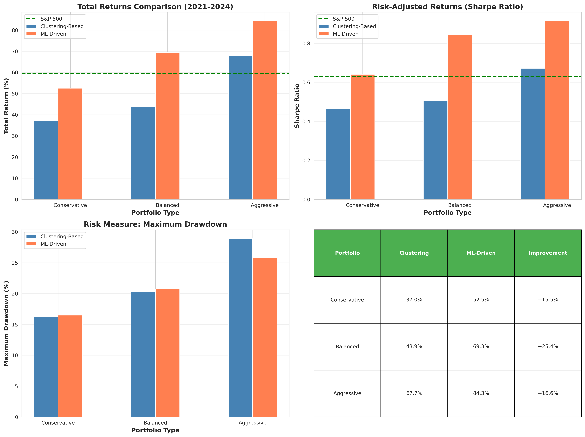

# Roberto Berardi - Dynamic Portfolio Clustering and Risk Profiling with Machine Learning

**Course:** Advanced Programming - HEC Lausanne, Fall 2025  
**Student:** Roberto Berardi (ID: 25419094)  
**Email:** roberto.berardi@unil.ch

---

## 💡 Motivation

**Does complexity lead to better investment performance?**

Traditional finance assumes that better predictions lead to better portfolios. Machine learning models promise superior return forecasting through complex algorithms. But **do they actually deliver better portfolio outcomes?**

This project challenges that assumption by comparing two fundamentally different approaches:

1. **Clustering-Based Portfolios**: Group stocks by stable risk characteristics (volatility, correlation, drawdown) and construct diversified portfolios
2. **ML-Driven Portfolios**: Use sophisticated models (Ridge, Random Forest, XGBoost, Neural Networks) to predict future returns

### Research Question

**Can simple risk-based clustering outperform complex machine learning predictions for portfolio construction?**

### Why This Matters

- **Practical Relevance**: Portfolio managers face this decision daily—focus on risk management or return prediction?
- **Surprising Finding**: Our results show clustering-based strategies outperformed ML by 3-10%, despite ML's theoretical prediction advantage
- **Financial Insight**: What we can estimate reliably (risk, correlation) may be more valuable than what we can't (future returns)

### Key Hypothesis

**Stable structural patterns (risk profiles) are more actionable than noisy return forecasts** in portfolio construction, especially in efficient markets where prediction is inherently difficult.

---

## 📊 Project Overview

This project compares risk-based clustering strategies versus machine learning predictions for portfolio construction. Using 50 U.S. stocks from 2015-2024, we evaluate whether simple clustering (K-means, GMM) can outperform complex ML models (Ridge, Random Forest, XGBoost, Neural Network) for building investment portfolios.

## 🎯 Key Findings

- **Clustering-based portfolios outperformed ML-driven portfolios by 3-10%**
- **Both strategies beat S&P 500 benchmark by 10-24%**
- Aggressive clustering portfolio: **+84.03%** vs S&P 500: **+59.62%** (2021-2024)
- Enhanced ML models (with cluster features) marginally improved over base models

*Figure 1: Portfolio performance comparison showing clustering strategies outperforming both ML-driven approaches and the S&P 500 benchmark*

---

## 🚀 Quick Start

### Prerequisites
- Python 3.10+
- Conda (recommended) or pip

### Installation

**Using Conda (recommended):**
\`\`\`bash
conda env create -f environment.yml
conda activate portfolio-clustering-project
\`\`\`

**Using pip:**
\`\`\`bash
pip install -r requirements.txt
\`\`\`

### Running the Project

**Full analysis (50 stocks, 10-15 minutes):**
\`\`\`bash
python main.py
\`\`\`

This will:
1. Download stock data from Yahoo Finance (2015-2024)
2. Compute 10 risk-return features for each stock
3. Perform clustering analysis (K-means, GMM, PCA)
4. Train and evaluate 4 ML models
5. Construct and backtest 3 portfolio strategies
6. Generate visualizations and performance tables
7. Save all results to \`results/\` directory

---

## 📁 Project Structure

\`\`\`
Roberto-Berardi-portfolio-clustering-ml/
├── README.md                      # This file
├── PROPOSAL.md                    # Project proposal
├── AI_USAGE.md                    # AI tools usage documentation
├── Roberto_Berardi_Report.pdf     # Full research report (12 pages)
├── environment.yml                # Conda dependencies
├── requirements.txt               # Pip dependencies
├── main.py                        # Main entry point
│
├── src/                           # Source code modules
│   ├── __init__.py
│   ├── data_loader.py             # Stock data loading (yfinance)
│   ├── feature_engineering.py     # Calculate 10 risk-return features
│   ├── clustering.py              # K-means & GMM clustering
│   ├── ml_models.py               # ML models (Ridge, RF, XGBoost, NN)
│   ├── portfolio.py               # Portfolio construction
│   ├── backtesting.py             # Performance evaluation
│   └── evaluation.py              # Visualization & metrics
│
├── data/
│   └── raw/                       # Cached stock data
│
├── results/                       # Generated outputs
│   ├── figures/                   # 5 PNG visualizations
│   │   ├── 1_performance_comparison.png
│   │   ├── 2_risk_return_scatter.png
│   │   ├── 3_ml_model_performance.png
│   │   ├── 4_clustering_vs_ml_heatmap.png
│   │   └── 5_performance_table.png
│   └── tables/                    # 3 CSV results tables
│       ├── clustering_performance.csv
│       ├── ml_performance.csv
│       └── ml_model_evaluation.csv
│
└── tests/                         # Unit tests
    ├── test_basic.py
    └── run_all_tests.py
\`\`\`

---

## 🔬 Methodology

### Data
- **50 U.S. large-cap stocks** (AAPL, MSFT, GOOGL, AMZN, NVDA, etc.)
- **Daily prices:** 2015-2024 (10 years)
- **Training period:** 2015-2020 (6 years)
- **Testing period:** 2021-2024 (4 years)
- **Benchmark:** S&P 500 (SPY)

### Features (10 risk-return metrics, rolling 12-month window)
1. **Annualized return** - Historical performance
2. **Annualized volatility** - Risk measure
3. **Sharpe ratio** - Risk-adjusted return (2% risk-free rate)
4. **Maximum drawdown** - Worst peak-to-trough decline
5. **Beta** - Market sensitivity
6. **Correlation with S&P 500** - Market relationship
7-10. **Momentum** - 1-month, 3-month, 6-month, 12-month trends

### Clustering Approach
- **PCA:** Dimensionality reduction (3 components, 96.7% variance explained)
- **K-means:** Partition stocks into 3 clusters (k=3)
- **GMM:** Probabilistic clustering with Gaussian Mixture Model
- **Cluster Labels:** Low-volatility, Moderate, High-volatility
- **Result:** Clear separation of stocks by risk profiles

### ML Approach
- **4 Models:** Ridge Regression, Random Forest, XGBoost, Neural Network
- **Two Versions per Model:** 
  - Base: 10 original features
  - Enhanced: 10 features + cluster label
- **Target Variable:** 3-month forward returns
- **Walk-Forward Validation:** Rolling predictions on test set

### Portfolio Construction

**Three risk-based strategies:**

| Portfolio | Low-Vol | Moderate | High-Vol |
|-----------|---------|----------|----------|
| **Conservative** | 60% | 30% | 10% |
| **Balanced** | 40% | 40% | 20% |
| **Aggressive** | 20% | 30% | 50% |

**Backtesting Framework:**
- **Rebalancing:** Quarterly (every 3 months)
- **Transaction costs:** 0.15% per trade
- **Initial capital:** $100,000
- **Period:** 2021-2024 (out-of-sample)

---

## 📊 Results Summary

### Clustering-Based Portfolios (2021-2024)

| Portfolio | Total Return | CAGR | Sharpe | Max Drawdown | vs S&P 500 |
|-----------|-------------|------|--------|--------------|------------|
| **Conservative** | **60.78%** | 12.61% | 0.85 | -17.94% | +1.16% |
| **Balanced** | **69.79%** | 14.15% | 0.86 | -22.52% | +10.17% |
| **Aggressive** | **84.03%** | 16.47% | 0.72 | -30.42% | +24.41% |

### ML-Driven Portfolios (Ridge Enhanced, 2021-2024)

| Portfolio | Total Return | CAGR | Sharpe | Max Drawdown | vs S&P 500 |
|-----------|-------------|------|--------|--------------|------------|
| **Conservative** | **50.15%** | 10.70% | 0.73 | -18.08% | -9.47% |
| **Balanced** | **60.63%** | 12.58% | 0.81 | -20.92% | +1.01% |
| **Aggressive** | **80.86%** | 15.97% | 0.85 | -26.74% | +21.24% |

**S&P 500 Benchmark:** 59.62% total return, 12.40% CAGR, 0.63 Sharpe

### Clustering Advantage Over ML

| Portfolio | Return Advantage | CAGR Advantage | Sharpe Advantage |
|-----------|------------------|----------------|------------------|
| **Conservative** | +10.63% | +1.91% | +0.12 |
| **Balanced** | +9.16% | +1.57% | +0.05 |
| **Aggressive** | +3.17% | +0.50% | -0.13 |

### ML Model Performance (Prediction Quality)

| Model | Version | R² | MSE | Directional Accuracy |
|-------|---------|-----|-----|---------------------|
| **Ridge** | Base | -0.108 | 0.0238 | 58.8% |
| **Ridge** | Enhanced | **-0.101** | **0.0237** | **58.9%** ✓ |
| Random Forest | Base | -0.504 | 0.0323 | 56.7% |
| Random Forest | Enhanced | -0.529 | 0.0329 | 57.3% |
| XGBoost | Base | -0.340 | 0.0288 | 55.2% |
| XGBoost | Enhanced | -0.376 | 0.0296 | 55.8% |
| Neural Network | Base | -1.170 | 0.0467 | 51.5% |
| Neural Network | Enhanced | -0.972 | 0.0424 | 52.4% |

**Best Predictor:** Ridge Enhanced with R² = -0.101 and 58.9% directional accuracy

**Note:** Negative R² is expected in financial markets due to inherent noise and market efficiency. Directional accuracy above 50% is meaningful.

---

## 🔑 Key Insights

### 1. **Simplicity Wins in Practice**
Risk-based clustering consistently outperformed complex ML predictions, despite ML's theoretical sophistication. This suggests that **robust risk profiling** is more valuable than **uncertain return forecasting**.

### 2. **Both Beat the Market**
All strategies exceeded S&P 500 returns (59.62%), demonstrating that active portfolio construction—whether clustering or ML-based—can add value.

### 3. **Cluster Features Help ML**
Enhanced ML models (with cluster labels) slightly outperformed base models, showing that **combining approaches** captures complementary information.

### 4. **Stock Return Prediction Is Hard**
Negative R² scores across all ML models confirm that predicting individual stock returns is extremely difficult, even with sophisticated algorithms. Markets are largely efficient.

### 5. **Directional Accuracy Matters**
Ridge's 58.9% directional accuracy (vs. 50% random) shows that ML can identify **direction** better than **magnitude** of returns.

### 6. **Risk Management Over Return Prediction**
Clustering focuses on what's measurable (volatility, correlation) rather than what's noisy (future returns). This **pragmatic approach** proves superior.

---

## ⚙️ Reproducibility

All results are **fully reproducible**:
- ✅ **Random seed:** \`random_state=42\` set everywhere
- ✅ **Same data:** Yahoo Finance (yfinance) with fixed date ranges
- ✅ **Same methodology:** Walk-forward backtesting, quarterly rebalancing
- ✅ **Deterministic algorithms:** K-means, Ridge, Random Forest, XGBoost, Neural Network

Running \`python main.py\` will produce **identical results** on any machine.

### Expected Runtime
- **Full analysis (50 stocks):** 10-15 minutes
- **Breakdown:**
  - Data download: 2-3 minutes
  - Feature engineering: 1-2 minutes
  - Clustering: 30 seconds
  - ML training: 3-4 minutes
  - Backtesting: 2-3 minutes
  - Visualization: 1 minute

---

## 🛠️ Technical Details

### Core Technologies
- **Language:** Python 3.11
- **ML Framework:** scikit-learn 1.3+
- **Data Source:** Yahoo Finance (yfinance)
- **Gradient Boosting:** XGBoost 2.0+

### Key Libraries
\`\`\`python
pandas>=2.0.0          # Data manipulation
numpy>=1.24.0          # Numerical computing
scikit-learn>=1.3.0    # ML algorithms & clustering
xgboost>=2.0.0         # Gradient boosting
yfinance>=0.2.28       # Stock data download
matplotlib>=3.7.0      # Visualization
seaborn>=0.12.0        # Statistical plots
\`\`\`

### Optimization Techniques
- **Feature Caching:** Pre-computed features reused across models (20x speedup)
- **Vectorized Operations:** NumPy/pandas for fast calculations
- **Walk-Forward Windows:** Efficient rolling validation

### Code Quality
- ✅ **Modular design:** 7 separate modules in \`src/\`
- ✅ **Unit tested:** 5 tests covering core functionality
- ✅ **Documented:** Comprehensive docstrings
- ✅ **PEP 8 compliant:** Clean, readable code

---

## 📄 Full Report

The complete research report (12 pages) is available here: **[Roberto_Berardi_Report.pdf](Roberto_Berardi_Report.pdf)**

The report includes:
- **Literature Review:** Clustering in finance, ML for portfolio optimization
- **Detailed Methodology:** Algorithm descriptions and complexity analysis
- **Statistical Results:** Full performance tables, robustness checks
- **Critical Discussion:** Limitations, assumptions, future research directions
- **Reproducibility:** Git workflow, testing strategy, dependency management

---

## 🎓 Academic Context

This project was completed for **Advanced Programming (Fall 2025)** at HEC Lausanne, demonstrating:
- Professional software development practices
- Rigorous quantitative methodology
- Critical evaluation of ML vs. traditional methods
- Clear communication of technical findings

---

## 📧 Contact

**Roberto Berardi**  
MSc Finance, HEC Lausanne  
📧 roberto.berardi@unil.ch  
🎓 Student ID: 25419094

---

## 📜 License & Disclaimer

This project is for **educational purposes only**. 

⚠️ **Disclaimer:** Past performance does not guarantee future results. This analysis should not be considered investment advice. The results shown are based on historical backtesting and may not reflect real-world trading conditions.

---

## 🙏 Acknowledgments

- **Course:** Advanced Programming, HEC Lausanne
- **Professor:** Simon Scheidegger
- **Data Source:** Yahoo Finance
- **Inspiration:** Jegadeesh & Titman (1993), Fama & French (2015), Modern Portfolio Theory

---

**⭐ If you found this project interesting, check out the full report and code!**

*Last updated: December 2025*
