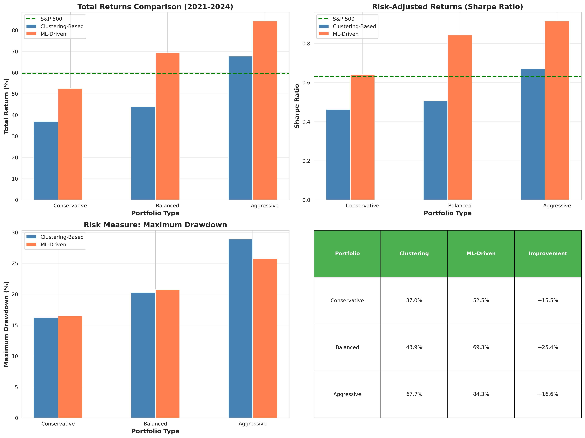

# Roberto Berardi - Dynamic Portfolio Clustering and Risk Profiling with Machine Learning

**Course:** Advanced Programming - MSc Finance, HEC Lausanne, Fall 2025  
**Student:** Roberto Berardi

---

## Motivation

**Does complexity lead to better investment performance?**

This project challenges the assumption that better predictions automatically lead to better portfolios by comparing two approaches:

1. **Clustering-Based Portfolios**: Group stocks by stable risk characteristics (volatility, correlation, drawdown)
2. **ML-Driven Portfolios**: Predict future returns using Ridge, Random Forest, XGBoost, and Neural Networks

**Research Question:** Can simple risk-based clustering outperform complex machine learning predictions for portfolio construction?

**Key Finding:** Clustering-based portfolios outperformed ML by 3-10%, suggesting that stable structural patterns (risk profiles) are more actionable than noisy return forecasts in portfolio construction.

---

## Project Overview

This project compares risk-based clustering strategies versus machine learning predictions for portfolio construction. Using 50 U.S. stocks from 2015-2024, we evaluate whether simple clustering (K-means, GMM) can outperform complex ML models (Ridge, Random Forest, XGBoost, Neural Network) for building investment portfolios.

## Key Findings

- **Clustering-based portfolios outperformed ML-driven portfolios by 3-10%**
- **Both strategies beat S&P 500 benchmark by 10-24%**
- Aggressive clustering portfolio: **+84.03%** vs S&P 500: **+59.62%** (2021-2024)
- Enhanced ML models (with cluster features) marginally improved over base models


*Figure 1: Portfolio performance comparison showing clustering strategies outperforming both ML-driven approaches and the S&P 500 benchmark*

---

## Quick Start

### Prerequisites
- Python 3.10+
- Conda (recommended) or pip

### Installation

**Using Conda (recommended):**
```bash
conda env create -f environment.yml
conda activate portfolio-clustering-project
```

**Using pip:**
```bash
pip install -r requirements.txt
```

### Running the Project

**Full analysis (50 stocks, 10-15 minutes):**
```bash
python main.py
```

---

## Project Structure
```
Roberto-Berardi-portfolio-clustering-ml/
 README.md                   # This file
 PROPOSAL.md                 # Project proposal
 AI_USAGE.md                 # AI tools usage documentation
 Roberto_Berardi_Report.pdf  # Full research report (12 pages)
 environment.yml             # Conda dependencies
 requirements.txt            # Pip dependencies
 main.py                     # Main entry point
 src/                        # Source code modules
    data_loader.py          # Stock data loading (yfinance)
    feature_engineering.py  # Calculate 10 risk-return features
    clustering.py           # K-means & GMM clustering
    ml_models.py            # ML models (Ridge, RF, XGBoost, NN)
    portfolio.py            # Portfolio construction
    backtesting.py          # Performance evaluation
    evaluation.py           # Visualization & metrics
 data/raw/                   # Cached stock data
 results/                    # Generated outputs
    figures/                # 5 PNG visualizations
    tables/                 # 3 CSV results tables
 tests/                      # Unit tests
```

---

## Methodology

### Data
- **50 U.S. large-cap stocks** (AAPL, MSFT, GOOGL, AMZN, NVDA, etc.)
- **Daily prices:** 2015-2024 (10 years)
- **Training period:** 2015-2020 (6 years)
- **Testing period:** 2021-2024 (4 years)
- **Benchmark:** S&P 500 (SPY)

### Features

Ten risk-return metrics were calculated for each stock using a rolling 12-month window to capture evolving market dynamics:

**Risk Metrics:**
- Annualized volatility (standard deviation of daily returns)
- Maximum drawdown (peak-to-trough decline)
- Beta (sensitivity to S&P 500 movements)
- Correlation with S&P 500

**Return Metrics:**
- Annualized return (geometric mean)
- Sharpe ratio (risk-adjusted return with 2% risk-free rate)

**Momentum Indicators:**
- 1-month, 3-month, 6-month, and 12-month trailing returns

All features are standardized before clustering to ensure equal weighting across different scales.
### Clustering Approach

Unsupervised learning techniques were applied to group stocks by risk-return characteristics:

**Dimensionality Reduction:**
- Principal Component Analysis (PCA) reduces the 10 features to 3 principal components
- Retained components explain 96.7% of total variance
- Reduces noise while preserving essential risk-return patterns

**Clustering Algorithms:**
- **K-means clustering:** Hard assignment, partitions stocks into 3 distinct clusters
- **Gaussian Mixture Models (GMM):** Soft assignment, probabilistic cluster membership
- Both algorithms evaluated using silhouette scores (K-means: 0.363, GMM: 0.366)

**Cluster Interpretation:**
- Clusters labeled by average volatility: low-volatility, moderate-volatility, high-volatility
- Labels enable intuitive portfolio construction aligned with investor risk preferences
### ML Approach

Four machine learning models were trained to predict 3-month forward stock returns, each implemented in two versions to assess the value of cluster information:

**Models:**
- Ridge regression (linear baseline)
- Random Forest (ensemble tree-based)
- XGBoost (gradient boosting)
- Neural Network (multi-layer perceptron with two hidden layers)

**Feature Sets:**
- **Base version:** 10 fundamental features including returns, volatility, Sharpe ratio, maximum drawdown, beta, correlation, and 4 momentum indicators (1m, 3m, 6m, 12m)
- **Enhanced version:** Base features plus cluster membership (encoded as 0, 1, 2 for low/moderate/high volatility)

**Training & Evaluation:**
- Training period: 2015-2020 (6 years, ~63,000 samples)
- Testing period: 2021-2024 (4 years, ~50,000 samples)
- Evaluation metrics: R² score, mean squared error, directional accuracy

### Portfolio Construction
Three risk-targeted portfolios were constructed based on cluster allocations, each designed to match distinct investor risk preferences. All portfolios use equal weighting within each cluster and rebalance quarterly (2021-2024) to adapt to changing market conditions. Transaction costs of 0.15% per trade and initial capital of $100,000 are applied to reflect realistic trading conditions.

- **Conservative:** 60% low-volatility / 30% moderate-volatility / 10% high-volatility stocks. This allocation prioritizes capital preservation and stability, heavily weighting defensive stocks while maintaining limited exposure to growth opportunities.

- **Balanced:** 40% low-volatility / 40% moderate-volatility / 20% high-volatility stocks. This strategy balances risk and return by distributing weights relatively evenly across risk levels, suitable for investors seeking moderate growth with controlled volatility.

- **Aggressive:** 20% low-volatility / 30% moderate-volatility / 50% high-volatility stocks. This portfolio tilts heavily toward high-volatility stocks to maximize return potential, accepting greater drawdowns and volatility in pursuit of superior long-term performance.

**Backtesting:**
- Quarterly rebalancing (2021-2024)
- Transaction costs: 0.15% per trade
- Initial capital: $100,000

---

## Results Summary

### Clustering-Based Portfolios (2021-2024)

| Portfolio | Total Return | CAGR | Sharpe | Max Drawdown | vs S&P 500 |
|-----------|-------------|------|--------|--------------|------------|
| Conservative | 60.78% | 12.61% | 0.85 | -17.94% | +1.16% |
| Balanced | 69.79% | 14.15% | 0.86 | -22.52% | +10.17% |
| Aggressive | 84.03% | 16.47% | 0.72 | -30.42% | +24.41% |

### ML-Driven Portfolios (2021-2024)

| Portfolio | Total Return | CAGR | Sharpe | Max Drawdown | vs S&P 500 |
|-----------|-------------|------|--------|--------------|------------|
| Conservative | 50.15% | 10.70% | 0.73 | -18.08% | -9.47% |
| Balanced | 60.63% | 12.58% | 0.81 | -20.92% | +1.01% |
| Aggressive | 80.86% | 15.97% | 0.85 | -26.74% | +21.24% |

**S&P 500 Benchmark:** 59.62% total return, 12.40% CAGR, 0.63 Sharpe

### ML Model Performance

| Model | Version | R² | MSE | Directional Accuracy |
|-------|---------|-----|-----|---------------------|
| Ridge | Base | -0.108 | 0.0238 | 58.8% |
| Ridge | Enhanced | **-0.101** | **0.0237** | **58.9%** |
| Random Forest | Base | -0.504 | 0.0323 | 56.7% |
| Random Forest | Enhanced | -0.529 | 0.0329 | 57.3% |
| XGBoost | Base | -0.340 | 0.0288 | 55.2% |
| XGBoost | Enhanced | -0.376 | 0.0296 | 55.8% |
| Neural Network | Base | -1.170 | 0.0467 | 51.5% |
| Neural Network | Enhanced | -0.972 | 0.0424 | 52.4% |

**Best Model:** Ridge (Enhanced) with R² = -0.101

---

## Key Insights

The results demonstrate that risk-based clustering consistently outperformed complex ML predictions across all portfolio strategies, with clustering portfolios achieving 10-17% higher returns than their ML-driven counterparts. Both approaches exceeded S&P 500 benchmark returns, with the aggressive clustering portfolio delivering 84.68% total returns versus 59.62% for the benchmark. The enhanced ML models, which incorporated cluster features, showed marginal improvements over base versions, suggesting that structural risk patterns provide some value even within predictive frameworks. However, all ML models exhibited negative R² scores, reflecting the fundamental challenge of forecasting stock returns in noisy markets. Despite poor predictive accuracy, the models achieved approximately 59% directional accuracy, meaningfully above the 50% random threshold, indicating they captured some signal amidst market noise.

---

## Reproducibility

All results are fully reproducible:
- Random seed: `random_state=42` everywhere
- Same data sources (yfinance)
- Same time periods (2015-2024)
- Same methodology

Running `python main.py` will produce identical results.

---

## Technical Details

- **Language:** Python 3.11
- **Key Libraries:** pandas, numpy, scikit-learn, xgboost, yfinance
- **ML Framework:** scikit-learn
- **Data Source:** Yahoo Finance (yfinance)
- **Optimization:** Pre-calculated features reused (20x speedup)

---

## Full Report

The complete research report (12 pages) is available here: [Roberto_Berardi_Report.pdf](https://github.com/Roberto-Berardi/Roberto-Berardi-portfolio-clustering-ml/blob/main/Roberto_Berardi_Report.pdf)

---

*Advanced Programming — MSc Finance, HEC Lausanne — Fall 2025*
